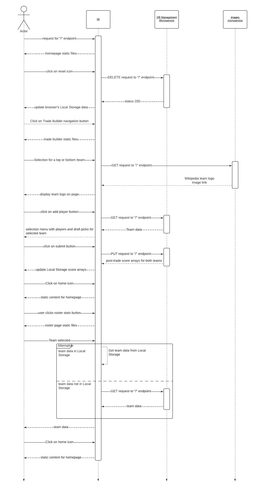

# Welcome to the NBA Trade Simulator UI Service

This service manages client-side interation for the NBA trade simulator app.
 
The other microservices used in conjuction with this web app can be found at:  
[https://github.com/josh-tan77/imgMicroservice](https://github.com/josh-tan77/imgMicroservice)  
[https://github.com/alexeyjleeper/NBA-Trade-Simulator-DB-Man](https://github.com/alexeyjleeper/NBA-Trade-Simulator-DB-Man)

# UML Sequence Diagram

# Installation

## Install Dependencies

>npm install

## Configure Microservice addresses

edit data management microservice address at:  
src/pages/Rosters.js:87  
src/pages/TradeBuilder.js:134, 204

edit image microservice address at:  
src/components/TradeContent.js:109

## Run

>npm start